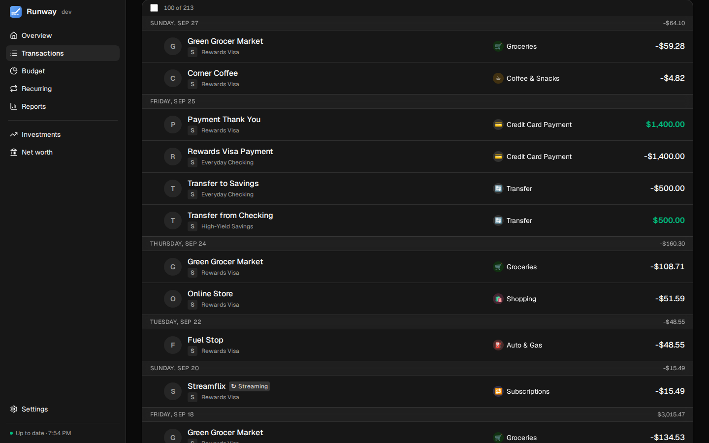
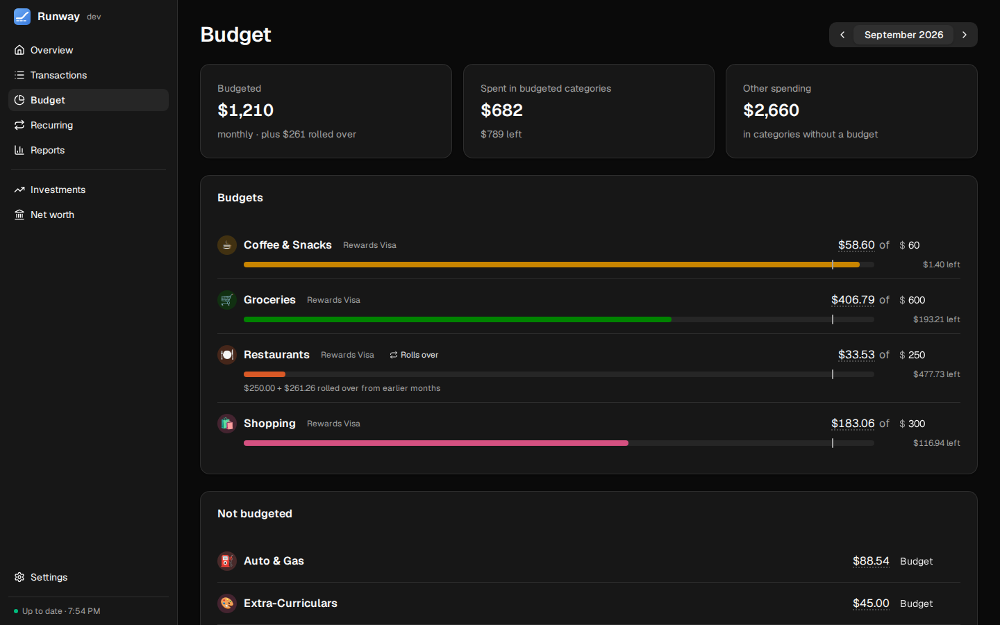

<p align="center">
  
</p>

<h1 align="center">Runway</h1>

<p align="center">
  <b>A self-hosted personal finance app that tells you how much runway your cash has.</b><br>
  Bank sync, a day-by-day cash-flow forecast, budgets, reports, investments and net worth, on your own hardware.
</p>

<p align="center">
  <a href="https://github.com/AnthonyPluth/Runway/actions/workflows/docker.yml"></a>
  <a href="https://github.com/AnthonyPluth/Runway/actions/workflows/docker.yml"></a>
  <a href="https://github.com/AnthonyPluth/Runway/actions/workflows/docker.yml"></a>
  
  
  
</p>

<p align="center">
  
</p>

---

## Why Runway

Most budgeting apps look backwards: what did I spend last month? Runway looks forward. It takes your checking balance, your paychecks and bills, and what each credit card will actually charge you on its due date, and draws the balance day by day for the next few months, so you can see the tightest moment before you get there.

It runs on your own computer or home server, keeps its data in one database you control (SQLite, or Postgres if you prefer), and is written in Python with a handful of well-known libraries.

## Features

- **Cash-flow forecast.** Your primary account, day by day for 30 days to 6 months, with the lowest point in plain language. Credit cards come out on their due dates using real statement balances from the issuer (through Plaid), and paydays and payments land on business days.
- **Bank sync, account by account.** SimpleFIN or Plaid for each account, once a day and on demand. Switching providers keeps your history.
- **Bills & income.** Paychecks, bills and subscriptions on any schedule, matched to transactions automatically, with a flag for payments that didn't happen.
- **Transactions and rules.** Categories with subcategories, split transactions, bulk editing, a review queue, and rules that categorize, rename or split by merchant, amount or account.
- **Optional AI categorization** through OpenRouter, with confidence scores and a log of every call.
- **Store orders.** A browser extension reads your Amazon, Target and Costco orders and splits each card charge by what you bought.
- **Budgets and reports.** Monthly budgets with rollover, a cash-flow Sankey, spending over time, merchants, income against spending, and a drill-down breakdown.
- **Net worth, investments and equity.** Accounts, homes and vehicles minus debts, recorded daily; brokerage performance with live prices; stock options, RSUs and Carta grants with vesting schedules.
- **Churning.** Sign-up bonuses, 5/24, annual fees, card benefits, bank bonuses and a plan for the cards you want next.
- **Notifications.** Web Push alerts for upcoming card payments, a low forecast, missed bills, large charges and more, with no third-party service involved.
- **An assistant-ready API.** A read-only [MCP server](docs/mcp.md) lets Claude or another assistant answer questions about your money.
- **Yours to keep.** Autosave everywhere, a dark interface that works on a phone (and installs as an app), and one-file backups that restore into SQLite or Postgres.

The full tour is in [docs/features.md](docs/features.md). Runway's pages are Overview, Transactions, Budget (with a Bills & income tab), Reports, Net worth (Summary, Investments, Equity and Retirement), Churning and Settings.

<table>
  <tr>
    <th>Transactions</th>
    <th>Budget</th>
  </tr>
  <tr>
    <td></td>
    <td></td>
  </tr>
  <tr>
    <th>Where money went</th>
    <th>On a phone</th>
  </tr>
  <tr>
    <td></td>
    <td></td>
  </tr>
</table>

<sub>Screenshots use Runway's made-up demo data (<code>python run.py demo</code>).</sub>

## Quick start

### Docker

```bash
git clone https://github.com/AnthonyPluth/Runway.git
cd Runway
cp .env.example .env      # set RUNWAY_PUBLIC_URL, OIDC_ISSUER, OIDC_CLIENT_ID/SECRET, OIDC_ALLOWED_EMAILS
docker compose up -d
```

The image is `ghcr.io/anthonypluth/runway:latest` (Intel/AMD and ARM). On a server, Runway requires sign-in through an OpenID Connect provider such as Authentik, Authelia, Keycloak, Pocket ID, Google or Microsoft Entra. [DOCKER.md](DOCKER.md) walks through registering Runway with your provider, the first start and updates.

### From source

You need Python 3.14, [Poetry](https://python-poetry.org/docs/#installation) 2 (`pipx install poetry`) and Node 22 (to build the web app once).

```bash
git clone https://github.com/AnthonyPluth/Runway.git
cd Runway
poetry install --no-root                   # the dependencies, into a virtualenv just for Runway
(cd frontend && npm ci && npm run build)   # the web app, into runway/static/app (again after each update)
poetry run python run.py
```

Open <http://localhost:8765>. Your data is stored in `data/runway.db`. To look around with made-up data first, run `poetry run python run.py demo`.

### First steps

1. **Connect your bank.** Create a setup token in [SimpleFIN Bridge](https://beta-bridge.simplefin.org) and paste it into **Settings → Bank connections**. The first sync pulls about six months of history. Or, with Plaid keys, connect through Plaid on the same tab (up to two years), and mix the two account by account under **Settings → Accounts**.
2. **Link your credit cards through Plaid** so Runway gets their statements and due dates, and set each card's paying account under **Settings → Accounts**. To choose which account the forecast shows, click the account name above the balance on **Overview**.
3. **Add your paychecks and bills** on **Budget → Bills & income**, or accept the ones Runway suggests.
4. Optionally add an OpenRouter, Realie, Finnhub or Logo.dev key under **Settings → Services**.

## Documentation

- [Features](docs/features.md): what each part of Runway does in detail.
- [Configuration](docs/configuration.md): every environment variable.
- [Deployment](docs/deployment.md): running on a server, your phone, Postgres, backups and migrations. See also [DOCKER.md](DOCKER.md).
- [AI assistants (MCP)](docs/mcp.md): connecting Claude or another assistant, read-only.
- [Architecture](docs/architecture.md): data sources, how the forecast works, the stack and its security model.
- [Development](docs/development.md): running the tests, changing the database, the code layout and releases.
- [Browser extension](extension/README.md) and [SECURITY.md](SECURITY.md) (reporting a vulnerability).

## How it's built

Runway is developed with AI coding assistants, under my direction. Every change goes through a pull request with review, and CI runs the full backend and frontend test suites (coverage in the badges above), type-checking, linting and a dependency audit before anything ships. Changes that touch bank connections, encryption or sign-in get extra scrutiny; see [SECURITY.md](SECURITY.md). The conventions the assistants follow are in [AGENTS.md](AGENTS.md).

## Security and privacy

Your data stays in your own database; outbound calls go only to the services you set up, and the AI (if enabled) sees only the date, amount, merchant text and account type. Sign-in through your OpenID Connect provider is mandatory beyond `localhost`, and bank access and API keys are encrypted at rest. The details are in [docs/architecture.md](docs/architecture.md#security-and-privacy); to report a vulnerability, see [SECURITY.md](SECURITY.md).

## Releases

Every push to `main` that passes the tests publishes a new image and a [GitHub Release](https://github.com/AnthonyPluth/Runway/releases). You can pin a version (`ghcr.io/anthonypluth/runway:1.2`) and upgrade when you choose. The running version is shown under **Settings → Advanced**; how versions are chosen is in [docs/development.md](docs/development.md#releases).

## License

Runway is licensed under the [GNU Affero General Public License v3.0](LICENSE).

---

<sub>The Geist typeface is © Vercel, used under the <a href="runway/static/fonts/Geist-LICENSE.txt">SIL Open Font License</a>.
Merchant, bank and card logos are from Plaid and <a href="https://logo.dev">Logo.dev</a>. They're trademarks of their owners.</sub>
